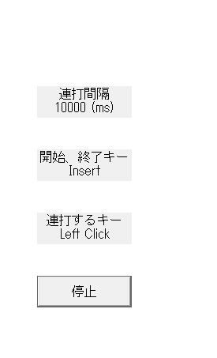

# 連打ツール

## 概要（予定）
バックグラウンドで動作し、特定のキーを一定間隔で連打、または一連の流れを繰り返し行うツールを作成しています。

## 実行環境（想定）
Windowsでの動作を想定しています

## 組み込み予定動作詳細(リリース前)
* 特定のキーの連打（マウス、キーボード含めすべてのキーに対応予定）
* 連打間隔の設定
* 開始、終了キーのカスタマイズ（Insert, Homeなどのキーがある島のみ対応予定）
* 一連の流れ(マクロ)の設定

## 組み込み完了動作
* 特定のキーの連打(マウスの右、左、中央クリックに対応。キーボードは英字キー、tab、Shift、Ctrlなどに対応)
* 連打間隔の設定(単位ms)
* 開始、終了キーのカスタマイズ（Insert, Homeなどのキーがある島のみ）

## 実際の実行画像

